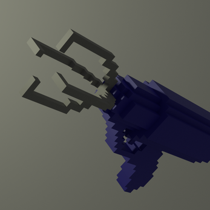

# Dorm-Disaster

## This is a 3d platform/puzzle game where you essentially have to use a grappling hook to get items into a box. It's pretty difficult, so good luck. I recommend starting on Regular with no timer before jumping into Easy, Medium, Hard or Endless

## Story
### You were packing up your college dorm to leave when somehow you were shrunk down to a little tiny ant person! And you still need to pack up your dorm! How will you do it? Thankfully you have a grappling hook. If you fire it you'll either pull your target towards you are be pulled to your target. Get items into the cardboard box to score points. Get all 15 items before the timer runs out! In endless mode, items will respawn and your countdown will increase with each item. You can start with any item, but there will be a random suggestion in the top right. Tip: if you're pulling an object, the farther you are from the object the harder you'll pull it. Also, heavier objects are harder to pull. Super Bonus Tip: you can cancel the grappling hook when you're being pulled by jumping

### This was originally made for the [Indie Tales Game Jam](https://itch.io/jam/indie-tales-jam/rate/1122188)

## How to Install

## Controls
### W - Move forward
### A - Move left
### S - Move back
### D - Move right
### Left Click - Fire grappling hook
* If you hook a solid surface, you will be pulled toward it
* If you hook an object, it will be pulled toward you
### Space - Jump OR to cancel grappling hook